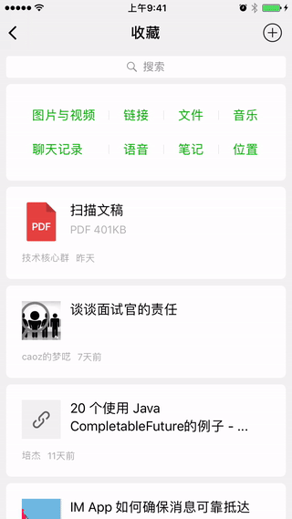
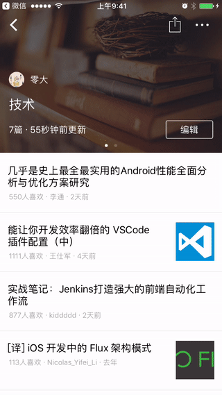
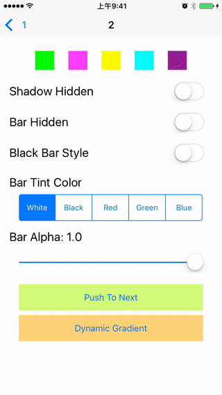
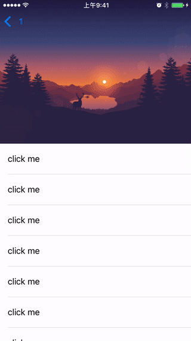
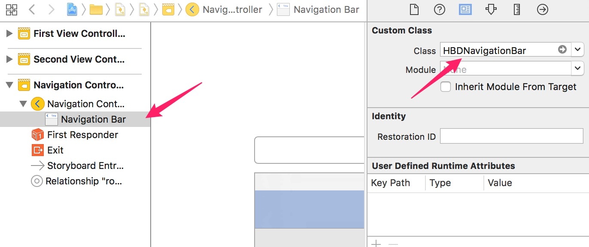

# HBDNavigationBar


UINavigationBar 是每一个 iOS 工程师都会遇到的坎，它令人抓狂的地方在于是否能随着页面切换而平滑地过渡到目的状态。想要把这件事情做好，不需要高深的算法，不需要深刻的底层原理，只需要一颗执着的内心。

##  介绍

我们来看微信是如何平滑切换导航栏的状态的



**我** 页面和 **收藏** 页面的导航栏具有不同的 barStyle 以及背景色

当从 **收藏** 右滑返回 **我** 页面时，NavigationBar 的背景被分成黑白两段，并且 bar 上的元素平滑切换，就和只有一个背景色时一样。

仔细观察，**我** 页面和 **收藏** 页面的导航栏背景颜色不一样，但是**都有毛玻璃效果**

**收藏** 页面往上滑动到一定程度时，导航栏会出现 shadowImage，此时如果右滑返回，导航栏依然在 **收藏** 页保留 shadowImage，然而 **我** 页面却没有这根线

不得不说，细节处理得真好

下面，我们来看一个反例，这是掘金 app 收藏页面的效果，当右滑返回上一个页面时，导航栏那反应实在是突兀，尖锐。

> 特别说明，本人举掘金这个例子，纯粹是因为掘金是本人常用 app 之一




导航栏的平滑过渡，可以划分为以下情况

### 阴影隐与现

以下展示了平滑切换 shadowImage 的隐与现



### 导航栏有与无

以下展示导航栏有与无之间的平滑切换，和调用 `setNavigationBarHidden:animated:` 的效果不一样哦


### 导航栏背景透与暗

这种效果是不是比掘金好多了



### 导航栏背景不同

看下面效果，导航栏背景的表现是不是和微信一样


## Usage

上面这些效果是三个类共同协作的结果：

HBDNavigationBar 继承 UINavigationBar

HBDNavigationController 继承 UINavigationController， 内部使用了 HBDNavigationBar

UIViewController(HBD) 是个分类，里面有一些可配置属性

```objc
@property (nonatomic, assign) UIBarStyle hbd_barStyle;   // 导航栏样式
@property (nonatomic, strong) UIColor *hbd_barTintColor; // 导航栏背景颜色
@property (nonatomic, strong) UIImage *hbd_barImage;     // 导航栏背景图片
@property (nonatomic, strong) UIColor *hbd_tintColor;    // 导航栏按钮颜色
@property (nonatomic, strong) NSDictionary *hbd_titleTextAttributes; // 导航栏标题属性
@property (nonatomic, assign) float hbd_barAlpha;        // 导航栏背景透明度
@property (nonatomic, assign) BOOL hbd_barHidden;        // 是否隐藏导航栏
@property (nonatomic, assign) BOOL hbd_barShadowHidden;  // 是否隐藏导航栏下面的阴影
@property (nonatomic, assign) BOOL hbd_backInteractive;  // 当前页面是否响应右滑返回，以及通过 `UINavigationBar` 的返回按钮返回，默认是 YES
@property (nonatomic, assign) BOOL hbd_swipeBackEnabled; // 当前页面是否可以右滑返回，默认是 YES
```

实际使用起来很简单

```objc
// HBDNavigationController 只有在创建 UINavigationController 时使用到
// HBDNavigationBar 只有在使用 storyboard 时才有机会登场
DemoViewController *vc = [[DemoViewController alloc] init];
self.window.rootViewController = [[HBDNavigationController alloc] initWithRootViewController:vc];
```

在 viewDidLoad 中通过分类配置想要的效果即可

```objc
@implementation DemoViewController
- (void)viewDidLoad {
[super viewDidLoad];
// 隐藏导航栏，就这样，不需要调用 setNavigationBarHidden:animated:
// 也不需要担心其它页面会受到影响
self.hbd_barHidden = YES; 
}
@end
```

如果你使用 storyboard, 除了设置 HBDNavigationController， 也别忘了设置 HBDNavigationBar



### 注意事项以及限制

`hbd_barHidden` 并不真正隐藏导航栏，只是把它变透明了，当然事件是可以穿透的，也正因为并不真正隐藏导航栏，才可以在导航栏有无之间平滑而优雅地切换

一旦通过 `hbd_barImage` 设置背景图片，`hbd_barTintColor` 就会失效

背景的计算规则如下：

1. hbd_barImage 是否有值，如果有，将其设置为背景，否则下一步
2. hbd_barTintColor 是否有值，如果有，将其设置为背景，否则下一步
3. [[UINavigationBar appearance] backgroundImageForBarMetrics:UIBarMetricsDefault] 是否有返回值，如果有，将其设置为背景，否则下一步
4. [UINavigationBar appearance].barTintColor 是否有值，如果有，将其设置为背景，否则下一步
5. 根据 barStyle 计算出默认的背景颜色，并将其设置为背景

如果使用图片来设置背景，并且希望带有透明度，使用带有透明度的图片即可。

如果需要毛玻璃效果，那么设置给 `hbd_barTintColor` 的值应该带有透明度，具体数值根据色值的不同而不同。不要通过 `hbd_barAlpha` 来调整毛玻璃效果，它是用来动态控制导航栏背景的透与暗的，就像掘金收藏页面那个效果一样。

图片是没有毛玻璃效果的

`isTranslucent` 的值总是 YES，这意味着，controller 的 view 总是位于导航栏底下

一个比较好的实践是通过 `[UINavigationBar appearance]` 来设置全局样式，然后在每个页面的 `viewDidLoad` 进行微调，如果有必要的话。

```objc
- (BOOL)application:(UIApplication *)application didFinishLaunchingWithOptions:(NSDictionary *)launchOptions
{
[[UINavigationBar appearance] setBarTintColor:...];
// ...
return YES;
}
```

#### 处理 isTranslucent 总是 YES 的问题

`isTranslucent` 总是 YES 会导致页面的内容总是位于 NavigationBar 底下，这可能会给某些同学带来困扰。我们目前解决这个问题的办法是定义一个基类：

```objc
@interface HBDViewController : UIViewController

@property (nonatomic, assign) BOOL hbd_extendedLayoutIncludesTopBar;

@end

BOOL hasAlpha(UIColor *color) {
    if (!color) {
        return YES;
    }
    CGFloat red = 0;
    CGFloat green= 0;
    CGFloat blue = 0;
    CGFloat alpha = 0;
    [color getRed:&red green:&green blue:&blue alpha:&alpha];
    return alpha < 1.0;
}

@implementation HBDViewController

- (void)viewDidLoad {
    [super viewDidLoad];
 
    if (!(self.hbd_extendedLayoutIncludesTopBar || hasAlpha(self.hbd_barTintColor))) {
        self.edgesForExtendedLayout = UIRectEdgeNone;
    }
}    

@end
```

基本原则就是如果我们设置的背景是含有透明度的，那么页面就应该位于 NavigationBar 底下(under)，否则位于 NavigationBar 下面(below).

如果我们的 NavigationBar 一开始是不透明的，但有可能因为用户操作而变透明，那么设置 `hbd_extendedLayoutIncludesTopBar` 的值为 YES，记得在 `[super viewDidLoad]` 之前设置好。

#### 拦截返回事件

有时，我们需要在用户点击返回按钮或者侧滑返回时提醒用户，此时，可以重写以下方法，返回 NO

```objc

- (BOOL)hbd_backInteractive {
    // show alert
    return NO;
}

```

## 感谢

在完善导航栏相关功能时，查看了 GitHub 上十多个相关项目，其中给我帮助最大的是 [YPNavigationBarTransition](https://github.com/yiplee/YPNavigationBarTransition)，它为我解决不同背景之间如何平滑切换提供了非常有价值的参考。


## Requirements

iOS 8+

## Installation

HBDNavigationBar is available through [CocoaPods](http://cocoapods.org). To install
it, simply add the following line to your Podfile:

```ruby
pod 'HBDNavigationBar', '~> 1.3.0'
```

## License

HBDNavigationBar is available under the MIT license. See the LICENSE file for more info.

